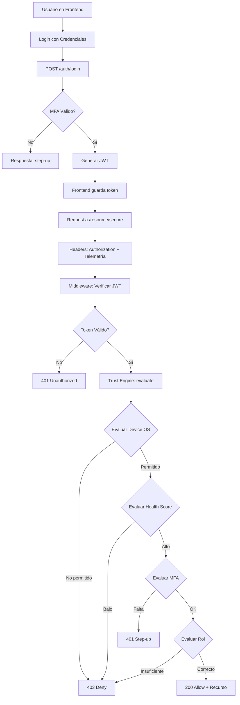
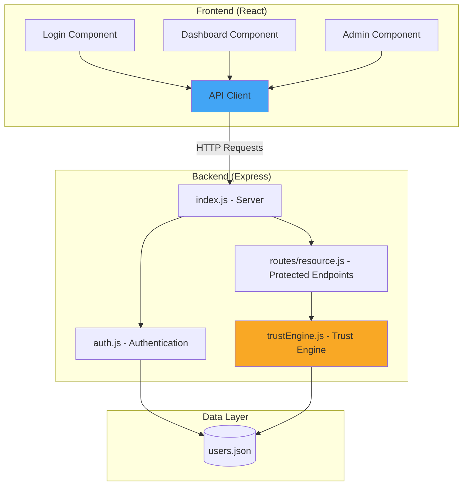
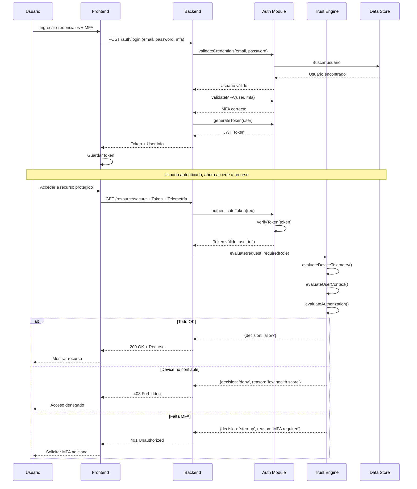

# 🔒 Zero Trust Architecture - Demostración Práctica

Una implementación educativa y funcional del modelo **Zero Trust** basada en los principios de Loftus, que demuestra cómo aplicar el concepto "nunca confíes, siempre verifica" en una aplicación web moderna.

## 📋 Tabla de Contenidos

- [Introducción](#introducción)
- [¿Qué es Zero Trust?](#qué-es-zero-trust)
- [Arquitectura del Proyecto](#arquitectura-del-proyecto)
- [Estructura de Carpetas](#estructura-de-carpetas)
- [Instalación y Ejecución](#instalación-y-ejecución)
- [Diagramas](#diagramas)
- [Ejemplos de Uso](#ejemplos-de-uso)
- [Testing con cURL](#testing-con-curl)
- [Casos de Uso](#casos-de-uso)
- [Extensiones Futuras](#extensiones-futuras)

---

## 🎯 Introducción

Este proyecto es una **demostración práctica** del modelo Zero Trust aplicado a una aplicación web. No es un sistema de producción, sino una herramienta educativa que muestra cómo implementar los principios fundamentales de Zero Trust:

- ✅ **Verificación continua**: Cada petición es evaluada independientemente
- ✅ **Menor privilegio**: Acceso basado en contexto y necesidad
- ✅ **Asume violación**: Ningún usuario o dispositivo es confiable por defecto
- ✅ **Decisiones centralizadas**: Un Trust Engine evalúa todas las solicitudes
- ✅ **Telemetría de dispositivos**: Evaluación del estado y contexto del dispositivo

---

## 🛡️ ¿Qué es Zero Trust?

**Zero Trust** es un modelo de seguridad que elimina la confianza implícita en cualquier entidad (usuario, dispositivo, red). Fue popularizado por John Kindervag de Forrester y desarrollado por empresas como Google (BeyondCorp) y autores como Chase Cunningham.

### Principios Fundamentales

1. **Nunca confíes, siempre verifica** - No hay confianza basada en ubicación de red
2. **Autenticación y autorización continua** - Cada acceso es evaluado
3. **Microsegmentación** - Limitar el radio de explosión de un compromiso
4. **Menor privilegio** - Solo el acceso mínimo necesario
5. **Inspección y logging** - Registrar y analizar todo el tráfico

### Implementación en este Proyecto

En este proyecto, el **Trust Engine** actúa como el componente central de decisión:

- **Autenticación**: Verifica credenciales y MFA
- **Evaluación de Telemetría**: Analiza el OS y health score del dispositivo
- **Autorización**: Verifica roles y permisos
- **Decisión**: Retorna `allow`, `deny` o `step-up` para cada petición

---

## 🏗️ Arquitectura del Proyecto

### Componentes Principales

#### Backend (Node.js + Express)
- **index.js**: Servidor principal con endpoints
- **auth.js**: Módulo de autenticación con JWT y MFA
- **trustEngine.js**: Motor de evaluación de confianza (Trust Engine)
- **routes/resource.js**: Endpoints protegidos con diferentes niveles de seguridad
- **data/users.json**: Base de datos simulada de usuarios

#### Frontend (React + Vite)
- **Login.jsx**: Pantalla de autenticación con MFA
- **Dashboard.jsx**: Panel para usuarios regulares
- **Admin.jsx**: Panel administrativo con acceso restringido
- **api.js**: Cliente HTTP con manejo de telemetría

### Flujo de Datos

1. Usuario ingresa credenciales en el frontend
2. Frontend envía credenciales + telemetría al backend
3. Backend valida y genera JWT si MFA es correcto
4. Para cada petición subsiguiente:
   - Frontend envía token + headers de telemetría
   - Backend valida token con `auth.js`
   - Trust Engine evalúa contexto completo
   - Backend responde según decisión del Trust Engine

---

## 📁 Estructura de Carpetas

```
zero-trust/
├── backend/
│   ├── index.js                 # Servidor Express principal
│   ├── auth.js                  # Autenticación y JWT
│   ├── trustEngine.js           # Motor de decisión Zero Trust
│   ├── package.json             # Dependencias del backend
│   ├── routes/
│   │   └── resource.js          # Endpoints protegidos
│   └── data/
│       └── users.json           # Usuarios de prueba
│
├── frontend/
│   ├── index.html               # HTML base
│   ├── vite.config.js           # Configuración de Vite
│   ├── package.json             # Dependencias del frontend
│   └── src/
│       ├── main.jsx             # Punto de entrada React
│       ├── App.jsx              # Componente principal
│       ├── Login.jsx            # Pantalla de login
│       ├── Dashboard.jsx        # Panel de usuario
│       ├── Admin.jsx            # Panel de administrador
│       └── api.js               # Cliente API
│
├── README.md                    # Este archivo
└── LICENSE
```

---

## 🚀 Instalación y Ejecución

### Requisitos Previos

- Node.js (versión 16 o superior)
- npm (incluido con Node.js)

### Paso 1: Instalar Dependencias

```bash
# Instalar dependencias del backend
cd backend
npm install

# Instalar dependencias del frontend
cd ../frontend
npm install
```

### Paso 2: Ejecutar el Backend

```bash
# Desde la carpeta backend
cd backend
npm run dev
```

El backend estará corriendo en `http://localhost:4000`

### Paso 3: Ejecutar el Frontend

En otra terminal:

```bash
# Desde la carpeta frontend
cd frontend
npm run dev
```

El frontend estará corriendo en `http://localhost:5173`

### Paso 4: Abrir en el Navegador

Abre tu navegador y visita `http://localhost:5173`

### Credenciales de Prueba

**Usuario Regular:**
- Email: `user@example.com`
- Password: `password`
- Rol: `user`

**Usuario Administrador:**
- Email: `admin@example.com`
- Password: `admin123`
- Rol: `admin`

---

## 📊 Diagramas

### Diagrama de Flujo de Autenticación y Decisión



### Diagrama de Componentes



### Diagrama de Secuencia de Evaluación Zero Trust



---

## 💻 Ejemplos de Uso

### 1. Login Exitoso con MFA

```bash
curl -X POST http://localhost:4000/auth/login \
  -H "Content-Type: application/json" \
  -d '{
    "email": "user@example.com",
    "password": "password",
    "mfa": true
  }'
```

**Respuesta:**
```json
{
  "decision": "allow",
  "message": "Authentication successful",
  "token": "eyJhbGciOiJIUzI1NiIsInR5cCI6IkpXVCJ9...",
  "user": {
    "email": "user@example.com",
    "role": "user"
  },
  "expiresIn": "5m"
}
```

### 2. Login sin MFA (Step-up Required)

```bash
curl -X POST http://localhost:4000/auth/login \
  -H "Content-Type: application/json" \
  -d '{
    "email": "user@example.com",
    "password": "password",
    "mfa": false
  }'
```

**Respuesta:**
```json
{
  "decision": "step-up",
  "reason": "Multi-factor authentication required",
  "message": "Please complete MFA to continue",
  "mfaRequired": true
}
```

### 3. Acceder a Recurso Público (Sin Autenticación)

```bash
curl http://localhost:4000/resource/public
```

**Respuesta:**
```json
{
  "message": "This is a public resource",
  "data": {
    "info": "Anyone can access this endpoint without authentication",
    "timestamp": "2025-11-09T..."
  }
}
```

### 4. Acceder a Recurso Seguro (Con Token y Telemetría Buena)

```bash
# Reemplaza <TOKEN> con el token obtenido del login
curl http://localhost:4000/resource/secure \
  -H "Authorization: Bearer <TOKEN>" \
  -H "x-device-os: linux" \
  -H "x-device-health-score: 90"
```

**Respuesta:**
```json
{
  "message": "Access granted to secure resource",
  "data": {
    "info": "This resource requires authentication and passes all security checks",
    "accessedBy": "user@example.com",
    "role": "user",
    "timestamp": "2025-11-09T...",
    "securityData": {
      "deviceTelemetry": {
        "os": "linux",
        "healthScore": "90"
      }
    }
  }
}
```

### 5. Acceso Denegado por Health Score Bajo

```bash
curl http://localhost:4000/resource/secure \
  -H "Authorization: Bearer <TOKEN>" \
  -H "x-device-os: linux" \
  -H "x-device-health-score: 30"
```

**Respuesta:**
```json
{
  "decision": "deny",
  "reason": "Device health score too low: 30. Minimum required: 50",
  "message": "Access denied",
  "detail": "Device telemetry check failed"
}
```

### 6. Acceso Denegado por Sistema Operativo No Permitido

```bash
curl http://localhost:4000/resource/secure \
  -H "Authorization: Bearer <TOKEN>" \
  -H "x-device-os: unknown" \
  -H "x-device-health-score: 90"
```

**Respuesta:**
```json
{
  "decision": "deny",
  "reason": "Operating system 'unknown' is not allowed. Allowed: linux, mac, windows, ios, android",
  "message": "Access denied",
  "detail": "Device telemetry check failed"
}
```

### 7. Acceso a Recurso Admin (Solo Admin)

```bash
# Primero hacer login como admin para obtener token
curl -X POST http://localhost:4000/auth/login \
  -H "Content-Type: application/json" \
  -d '{
    "email": "admin@example.com",
    "password": "admin123",
    "mfa": true
  }'

# Usar el token para acceder al recurso admin
curl http://localhost:4000/resource/admin \
  -H "Authorization: Bearer <ADMIN_TOKEN>" \
  -H "x-device-os: mac" \
  -H "x-device-health-score: 95"
```

**Respuesta:**
```json
{
  "message": "Access granted to admin resource",
  "data": {
    "info": "This is a restricted administrative resource",
    "adminUser": "admin@example.com",
    "timestamp": "2025-11-09T...",
    "adminFeatures": [
      "User management",
      "Security policy configuration",
      "Audit logs",
      "System settings"
    ]
  }
}
```

### 8. Usuario Regular Intenta Acceder a Recurso Admin

```bash
curl http://localhost:4000/resource/admin \
  -H "Authorization: Bearer <USER_TOKEN>" \
  -H "x-device-os: linux" \
  -H "x-device-health-score: 90"
```

**Respuesta:**
```json
{
  "decision": "deny",
  "reason": "Insufficient privileges. Required: admin, Current: user",
  "message": "Access denied",
  "detail": "Authorization check failed"
}
```

### 9. Validar Token Existente

```bash
curl -X POST http://localhost:4000/auth/validate \
  -H "Content-Type: application/json" \
  -d '{
    "token": "<TOKEN>"
  }'
```

**Respuesta si es válido:**
```json
{
  "valid": true,
  "user": {
    "email": "user@example.com",
    "role": "user",
    "mfaVerified": true
  }
}
```

### 10. Obtener Políticas de Seguridad

```bash
curl http://localhost:4000/auth/policies
```

**Respuesta:**
```json
{
  "policies": {
    "allowedOS": ["linux", "mac", "windows", "ios", "android"],
    "minHealthScore": 50,
    "requireMFA": true,
    "highSecurityRoles": ["admin"]
  },
  "description": "Current security policies for Zero Trust evaluation"
}
```

---

## 🧪 Testing con cURL

### Script de Testing Completo

Crea un archivo `test-zero-trust.sh`:

```bash
#!/bin/bash

API="http://localhost:4000"

echo "======================================"
echo "Zero Trust API Testing Suite"
echo "======================================"
echo ""

# Test 1: Login exitoso
echo "1. Login exitoso con MFA"
TOKEN=$(curl -s -X POST $API/auth/login \
  -H "Content-Type: application/json" \
  -d '{"email":"user@example.com","password":"password","mfa":true}' \
  | grep -o '"token":"[^"]*' | sed 's/"token":"//')
echo "Token obtenido: ${TOKEN:0:20}..."
echo ""

# Test 2: Acceso a recurso público
echo "2. Acceso a recurso público"
curl -s $API/resource/public | jq .
echo ""

# Test 3: Acceso exitoso a recurso seguro
echo "3. Acceso exitoso a recurso seguro (health score alto)"
curl -s $API/resource/secure \
  -H "Authorization: Bearer $TOKEN" \
  -H "x-device-os: linux" \
  -H "x-device-health-score: 90" \
  | jq .
echo ""

# Test 4: Acceso denegado por health score bajo
echo "4. Acceso denegado por health score bajo"
curl -s $API/resource/secure \
  -H "Authorization: Bearer $TOKEN" \
  -H "x-device-os: linux" \
  -H "x-device-health-score: 30" \
  | jq .
echo ""

# Test 5: Acceso denegado por OS no permitido
echo "5. Acceso denegado por OS desconocido"
curl -s $API/resource/secure \
  -H "Authorization: Bearer $TOKEN" \
  -H "x-device-os: unknown" \
  -H "x-device-health-score: 90" \
  | jq .
echo ""

# Test 6: Login admin y acceso a recurso admin
echo "6. Login como admin"
ADMIN_TOKEN=$(curl -s -X POST $API/auth/login \
  -H "Content-Type: application/json" \
  -d '{"email":"admin@example.com","password":"admin123","mfa":true}' \
  | grep -o '"token":"[^"]*' | sed 's/"token":"//')
echo "Token admin obtenido: ${ADMIN_TOKEN:0:20}..."
echo ""

echo "7. Acceso exitoso a recurso admin"
curl -s $API/resource/admin \
  -H "Authorization: Bearer $ADMIN_TOKEN" \
  -H "x-device-os: mac" \
  -H "x-device-health-score: 95" \
  | jq .
echo ""

# Test 7: Usuario regular intenta acceder a admin
echo "8. Usuario regular intenta acceder a recurso admin (denegado)"
curl -s $API/resource/admin \
  -H "Authorization: Bearer $TOKEN" \
  -H "x-device-os: linux" \
  -H "x-device-health-score: 90" \
  | jq .
echo ""

echo "======================================"
echo "Testing completado"
echo "======================================"
```

Para ejecutar el script:

```bash
chmod +x test-zero-trust.sh
./test-zero-trust.sh
```

---

## 📚 Casos de Uso

### Caso 1: Usuario Legítimo con Dispositivo Confiable

**Escenario**: Un usuario regular accede desde su laptop corporativa con seguridad actualizada.

- ✅ Credenciales válidas
- ✅ MFA completado
- ✅ OS permitido (mac)
- ✅ Health score alto (90)

**Resultado**: `allow` - Acceso completo a recursos de usuario

### Caso 2: Usuario con Dispositivo Comprometido

**Escenario**: Un usuario intenta acceder desde un dispositivo con antivirus desactualizado.

- ✅ Credenciales válidas
- ✅ MFA completado
- ✅ OS permitido (windows)
- ❌ Health score bajo (30)

**Resultado**: `deny` - Acceso denegado hasta que el dispositivo sea asegurado

### Caso 3: Usuario Sin MFA

**Escenario**: Un usuario intenta acceder sin completar la segunda factor de autenticación.

- ✅ Credenciales válidas
- ❌ MFA no completado

**Resultado**: `step-up` - Se solicita completar MFA antes de continuar

### Caso 4: Escalada de Privilegios Intentada

**Escenario**: Un usuario regular intenta acceder a recursos administrativos.

- ✅ Credenciales válidas
- ✅ MFA completado
- ✅ Dispositivo confiable
- ❌ Rol insuficiente (user intentando acceder a admin)

**Resultado**: `deny` - Acceso denegado por autorización insuficiente

### Caso 5: Dispositivo No Reconocido

**Escenario**: Acceso desde un dispositivo con OS no corporativo.

- ✅ Credenciales válidas
- ❌ OS no permitido (unknown/jailbroken)

**Resultado**: `deny` - Dispositivo no cumple con políticas corporativas

---

## 🔮 Extensiones Futuras

Este proyecto es una base educativa. Para convertirlo en un sistema de producción, considera:

### Seguridad
- [ ] Integrar con IdP real (Auth0, Okta, Azure AD)
- [ ] Implementar MFA real (TOTP, WebAuthn, SMS)
- [ ] Usar variables de entorno para secrets
- [ ] Implementar rate limiting y protección DDoS
- [ ] Agregar HTTPS con certificados TLS

### Telemetría Avanzada
- [ ] Agente de telemetría en el cliente (detectar antivirus, firewall, etc.)
- [ ] Geolocalización y detección de VPN
- [ ] Análisis de comportamiento del usuario
- [ ] Detección de dispositivos corporativos vs personales
- [ ] Integración con MDM (Mobile Device Management)

### Trust Engine
- [ ] Políticas dinámicas basadas en contexto (horario, ubicación)
- [ ] Machine Learning para detectar anomalías
- [ ] Scores de riesgo adaptativos
- [ ] Integración con SIEM para correlación de eventos
- [ ] Políticas basadas en grupos y atributos (ABAC)

### Funcionalidades
- [ ] Audit logging completo
- [ ] Dashboard de administración en tiempo real
- [ ] Alertas y notificaciones
- [ ] Sesiones con refresh tokens
- [ ] Revocación de tokens en tiempo real

### Base de Datos
- [ ] Migrar de JSON a base de datos real (PostgreSQL, MongoDB)
- [ ] Cache con Redis para tokens
- [ ] Persistencia de sesiones y audit logs

### Escalabilidad
- [ ] Containerización con Docker
- [ ] Orquestación con Kubernetes
- [ ] Load balancing
- [ ] Microservicios

---

## 📖 Referencias

- [NIST Zero Trust Architecture (SP 800-207)](https://csrc.nist.gov/publications/detail/sp/800-207/final)
- [Google BeyondCorp](https://cloud.google.com/beyondcorp)
- [Forrester Zero Trust eXtended (ZTX)](https://www.forrester.com/what-it-means/zero-trust/)
- [Chase Cunningham - "Zero Trust Networks" (O'Reilly)](https://www.oreilly.com/library/view/zero-trust-networks/9781491962183/)

---

## 📝 Notas Finales

### Propósito Educativo

Este proyecto está diseñado para **enseñar los conceptos de Zero Trust** de manera práctica. No es un sistema listo para producción. En un entorno real:

- Los secretos deben estar en variables de entorno
- La autenticación debe usar proveedores externos (OAuth, SAML)
- La telemetría debe venir de agentes de seguridad reales
- Debe haber logging, monitoring y alertas
- Las políticas deben ser dinámicas y centralizadas

### Contribuciones

Este es un proyecto educativo abierto. Las contribuciones para mejorar la claridad, agregar ejemplos o extender funcionalidades son bienvenidas.

### Licencia

MIT License - Ver archivo LICENSE para más detalles.

---

**¿Preguntas o sugerencias?** Abre un issue en el repositorio.

**¡Disfruta aprendiendo sobre Zero Trust!** 🚀🔒
Practical example of Zero Trust (inspired by Loftus)
